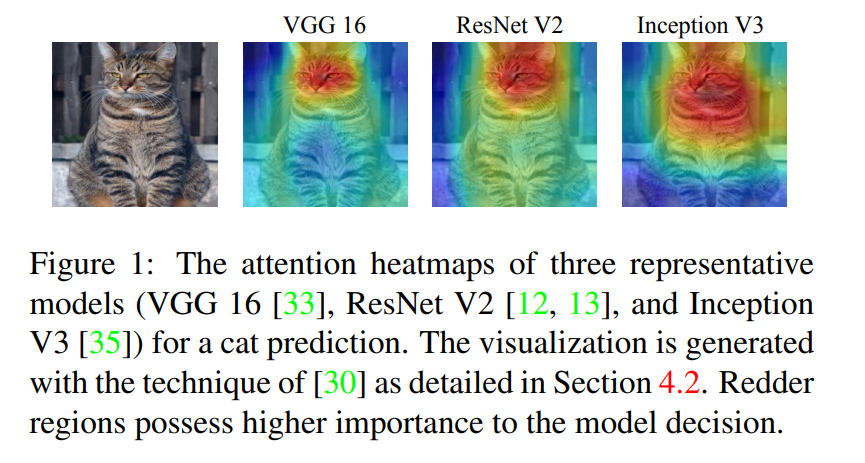
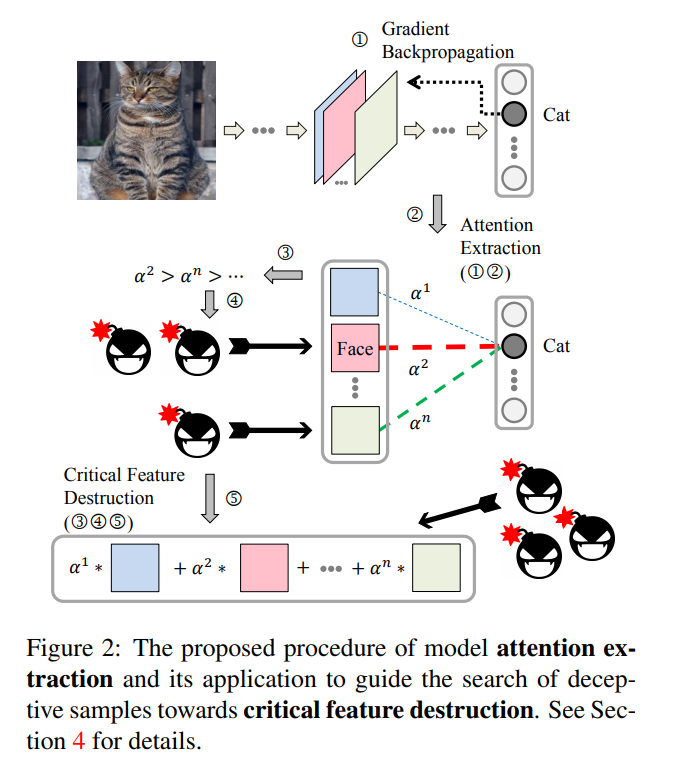

#Boosting the Transferability of Adversarial Samples via Attention

`论文收录于CVPR 2020`

###问题

作者将对抗攻击分为白盒攻击和黑盒攻击

attack：
  - white-box attack
  - black-box attack
    - query-based attack： 根据返回结果确定被攻击模型量变影响的方向
    - transfer-based attack(本文关注点)： 引入正则化可以显著提高攻击效果
  
transfer-based attack指训练一个替代模型，由替代模型生成的对抗样本基于迁移性，直接攻击目标模型。
但该方法容易产生一个问题：训练的替代模型容易过拟合，这会损害对抗样本的迁移性

提升对抗样本迁移性的方法：
  - ensamble-based
  - regularization-based (TAP就属于该方法，进行了两次正则化)

###之前的攻击方法

**TAP**

在实验过程中，TAP方法的攻击性及迁移性都是很好的，并且在一些情况下甚至超过了本文提出的ATA。
TAP缓解了梯度消失的问题，减少了生成的对抗样本的多样性。

TAP进行了两次正则化，本文提出的ATA只进行了一次正则化。

###ATA

1、期望对抗样本的搜索朝着替代模型和目标模型共同易受攻击的方向

2、作者观察到，大部分模型提取到的关键特征基本是相同的，如图1所示

3、通过注意力机制将最易受攻击的特征提取出来，将扰动加在这些特征上

4、过程

1）attention extraction：通过反向传播梯度估计不同特征对模型方向的重要性

作者将整个feature map当作基础的特征提取器，因此，我们通过以下公式估计在分类为t时Ack(第k层的第c个feature map)的权重

$\alpha$ck [t] = $\frac{1}{Z}$ $\sum_{m}$ $\sum_{n}$ $\frac{\partial f(x)[t]}{\partial Ack[m,n]}$

Z是归一化常量（normalizing constant），为了使$\alpha$ ck[i] $\in$ [-1, 1]

我们称$\alpha$ k [t] 为分类为t时在第k层提取出的不同特征的注意力权重

2）choose critical features

Htk = ReLU($\sum_{c}$ $\alpha$ ck[t]·Ack)

Htk成为attention map， 它的分辨率是与第k层feature map的分辨率一样大的，因为不同模型和不同层的feature maps大小不一致，所以通过双线性插值的方式
将attention map的分辨率调整到和输入图像大小一致。

通过ReLU方法可以移除attention map中对分类t消极的特征，这样保留下来对分类t积极的特征。

对注意力权重较大的特征进行较大的改变

3）critial feature destruction

不仅误导模型错误分类，而且扰动最重要的中间特征。最终的优化损失目标函数是

maximize J(x,x',t,f),

where J(x,x',t,f) = l(f(x'), t) + $\lambda$ $\sum_{k}$ || Htk{(x')} \- Htk() || 2

subject to ||x' - x||p $\leq$ $\epsilon$

l(·)是分类损失， $\lambda$ 是可调的权重参数，控制正则化的影响

5、实验

作者在攻击能力和迁移性方面进行了实验，效果证明普遍由于其它方法，且生成的图片不易被察觉。

[code] None

[paper](https://paperswithcode.com/paper/boosting-the-transferability-of-adversarial) https://paperswithcode.com/paper/boosting-the-transferability-of-adversarial