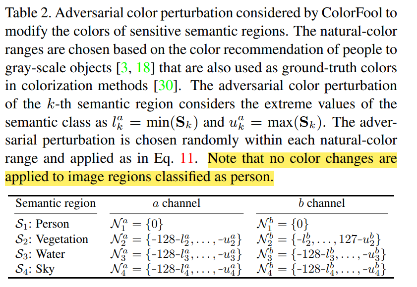

#ColorFool: Semantic Adversarial Colorization

`论文收录于CVPR 2020`

###问题

作者将对抗扰动分为 restricted 和 unrestricted

restricted 是指通过 Lp 范式控制扰动的大小。这种攻击方式对去噪滤波器、对抗训练
等防御并不健壮,因为这种扰动通常具有高的空间频率(spatial frequencies)，容易被检测到。

unrestricted 并不控制扰动的大小，对防御具有健壮性，且生成的对抗样本更具有迁移性。但是也更容易被
人眼识别。

所以，作者提出了一种基于内容的、unrestricted的黑盒攻击方法，通过语义分割技术将图片分为人眼敏感区域
和不敏感区域，有选择地修改区域内的颜色

###之前的攻击方法

**SemanticAdv:** unrestricted、black-box attack 改变HSV颜色空间中的颜色，且只改变H和S通道。
该方法的问题是对所有区域都添加扰动，所以会产生一些对人眼来说不自然的颜色。

* **HSV：**
  
  * `H: hue 色调`

  * `S: saturation 饱和度`
    
  * `V: value 值`
    
**BigAdv:** 

###ColorFool

1、作者使用的颜色形式不是RGB，而是Lab，且只在a、b通道上添加扰动。生成的对抗样本与干净样本的大小一致。

* **Lab：** 

  * `a ranges from green(-128) to red (+127)`

  * `b ranges from blue(-128) to yellow(+127)`

  * `L ranges from black(0) to white(100)`

2、作者定义四种人眼对颜色敏感的区域，在敏感区域上添加的扰动为了符合人眼自然视觉
感知，添加的扰动是有条件的，如表2

* S1: 人 person 人不进行扰动

* S2: 天空 sky

* S3: 植被 vegetation(e.g. grass and tree)

* S4: 水 water(e.g. sea, river, waterfall, swimming pool and lake)

3、方法步骤

1）图片通过训练好的语义分割模型，得到敏感区域和不敏感区域

2）敏感区域 **S1 = {S1k: S1k=$\gamma$(Sk) + $\alpha$[0, Nak, Nbk]^T}Sk=1**

$\gamma$(.)将RGB图像转换成Lab， Nak, Nbk是添加在a， b通道上的扰动，扰动范围如表2所示。

3）不敏感区域 **$\overline{S}$ = {$\overline{S}$k: $\overline{S}$k=$\gamma$($\overline{S}$k) + $\alpha$[0, $\overline{N}$a, $\overline{N}$b]T}$\overline{S}$k=1**

$\overline{N}$a$\in${-127, ... , 128}

$\overline{N}$b$\in${-127, ... , 128}

4)生成对抗样本
